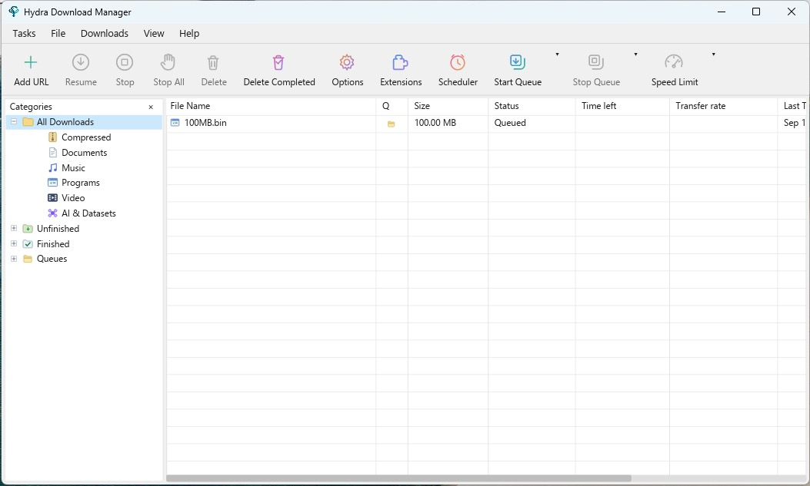

<p align="center">
  
</p>

<h1 align="center">Hydra Download Manager (HDM)</h1>

<p align="center">
  <strong>Fast, resilient, multi-source download manager and accelerator for Windows, macOS, and Linux.</strong><br>
  <a href="https://hydra.javad.dev"><strong>https://hydra.javad.dev</strong></a>
</p>

<p align="center">
  <a href="https://crates.io/crates/hya-core"></a>
  <a href="https://docs.rs/hya-core"></a>
  <a href="https://codecov.io/gh/ja7ad/hydra"></a>
  <a href="https://github.com/ja7ad/hydra/actions/workflows/ci.yml"></a>
  <a href="LICENSING.md"></a>
  
</p>

---

## Contents

- [Overview](#overview)
- [Key Features](#key-features)
  - [Engine](#engine)
  - [CLI](#cli)
  - [Desktop GUI](#desktop-gui)
- [Installation](#installation)
  - [Homebrew (macOS / Linux)](#homebrew-macos--linux)
  - [Linux Packages (Ubuntu PPA / Fedora COPR / Arch Linux AUR)](#linux-packages-ubuntu-ppa--fedora-copr--arch-linux-aur)
  - [AppImage (portable, self-updating)](#appimage-portable-self-updating)
  - [Quick Install (prebuilt binaries)](#quick-install-prebuilt-binaries)
  - [From Source](#from-source)
  - [Browser Extension](#browser-extension)
- [Uninstall](#uninstall)
  - [Quick Uninstall (prebuilt installs)](#quick-uninstall-prebuilt-installs)
- [Usage](#usage)
  - [Basic Download](#basic-download)
  - [Multi-Connection & Mirror Sources](#multi-connection--mirror-sources)
  - [CLI Compatibility (`wget` / `curl` Mode)](#cli-compatibility-wget--curl-mode)
  - [Interactive Queue Manager (TUI)](#interactive-queue-manager-tui)
  - [Remote Checksum Lookup & Verification](#remote-checksum-lookup--verification)
- [Embedding HYDRA — `libhydra`](#embedding-hydra--libhydra)
  - [Platform guides](#platform-guides)
- [Contributing](#contributing)
- [License](#license)

---

## Overview

**Hydra Download Manager (HDM)** is an open-source, high-performance network file retriever and download accelerator designed for speed, resilience, and adaptability. It dynamically partitions downloads across multiple connections and independent mirror sources, continuously rebalancing work to maximize throughput without stalling on slow peers. It ships as both a `wget`/`curl`-compatible CLI and a cross-platform desktop download manager with browser integration.

<p align="center">
  
</p>

## Key Features

<table>
<tr><td valign="top" width="33%">

### Engine

- **Adaptive Concurrency** — splits files across connections and mirrors, rebalancing live
- **Range Stealing** — reassigns work from slow peers to fast ones automatically
- **Stall Detection** — statistical estimators catch degraded connections early
- **Broad Protocol Support** — HTTP(S), FTP, CONNECT tunneling, SOCKS4/4a/5
- **Integrity Checks** — checksum manifests plus Reed–Solomon bitrot protection
- **Flat Memory Use** — direct positioned writes keep RAM usage constant

</td><td valign="top" width="33%">

### CLI

- **`hydra` or `hya`** — the same CLI under a short second name, on every platform
- **`wget` / `curl` Compatible** — drop-in flag and dialect support
- **Interactive TUI** — manage, pause, resume, and monitor queued downloads
- **Smart File Sorting** — content-based type detection and auto-sort
- **Remote Checksum Lookup** — verify server-advertised digests before or after download

</td><td valign="top" width="33%">

### Desktop GUI

- **Cross-Platform App** — Windows, macOS, and Linux with categories and progress detail
- **Browser Integration** — Chrome, Edge, Firefox, and Safari extensions hand off downloads
- **Queue & Scheduler** — scheduled start/stop times with retry tracking
- **Desktop Niceties** — tray icon, sounds, launch-on-startup, localized UI

</td></tr>
</table>

---

## Installation

### Homebrew (macOS / Linux)

**CLI**:

```bash
brew install ja7ad/tap/hydra
```

**macOS Desktop App (GUI)**:

```bash
brew install --cask ja7ad/tap/hydra
```

### Linux Packages (Ubuntu PPA / Fedora COPR / Arch Linux AUR)

**Ubuntu / Debian-based (Launchpad PPA)**:

```bash
sudo add-apt-repository ppa:sonycore/hydra
sudo apt update
sudo apt install hydra
```

> PPA Repository: [launchpad.net/~sonycore/+archive/ubuntu/hydra](https://launchpad.net/~sonycore/+archive/ubuntu/hydra)

**Fedora / RHEL-based (Fedora COPR)**:

```bash
sudo dnf copr enable sonycore/hydra
sudo dnf install hydra
```

> COPR Repository: [copr.fedorainfracloud.org/coprs/sonycore/hydra](https://copr.fedorainfracloud.org/coprs/sonycore/hydra/)

**Arch Linux (AUR)**:

Build from source:

```bash
paru -S hydra-download-manager
# or: yay -S hydra-download-manager
```

Precompiled binary:

```bash
paru -S hydra-download-manager-bin
# or: yay -S hydra-download-manager-bin
```

> AUR Packages: [hydra-download-manager](https://aur.archlinux.org/packages/hydra-download-manager) | [hydra-download-manager-bin](https://aur.archlinux.org/packages/hydra-download-manager-bin)

### AppImage (portable, self-updating)

One file, no installation, no root. Download it from the
[latest release](https://github.com/ja7ad/hydra/releases/latest), make it
executable, and run it:

```bash
chmod +x Hydra-*-x86_64.AppImage
./Hydra-*-x86_64.AppImage
```

`aarch64` images are published alongside the `x86_64` ones. Every release is
built on the oldest supported Ubuntu and verified to run on 22.04 through the
current release, so one image covers the whole line and the distributions
downstream of it.

The image carries the GUI, the `hydra` CLI, the `hydra-host` native-messaging
bridge and the update finisher. On its first start it writes a menu entry, a
copy of the browser extensions and the native-messaging manifests into
`~/.local/share/hydra` — all of them pointing at the image file, so moving or
renaming it is repaired on the next launch. Nothing is written outside your
home directory and nothing needs root.

| Command | What it does |
| --- | --- |
| `./Hydra-*.AppImage` | run the GUI |
| `./Hydra-*.AppImage --hydra-exec hydra …` | run the CLI inside the image |
| `./Hydra-*.AppImage --hydra-install` | write the menu entry and browser manifests now |
| `./Hydra-*.AppImage --hydra-uninstall` | remove them again (downloads and settings are kept) |
| `./Hydra-*.AppImage --hydra-extensions` | print the directory to load the unpacked extensions from |

Set `HYDRA_APPIMAGE_NO_INTEGRATION=1` for a run that writes nothing outside
your download directory. For a fully self-contained copy — settings included —
create a directory named after the image with a `.home` suffix next to it
(`Hydra-0.3.14-x86_64.AppImage.home`); the AppImage runtime then uses it as
`$HOME`, which is what makes the image portable across machines on a USB stick.

**Updates.** This is the one Linux build Hydra can update itself: the deb and
the rpm install into `/usr`, which only their package manager may rewrite, so
the in-app updater offers you the new package instead of touching those files.
An AppImage is a single file you own wherever you put it, so **Update Now**
replaces that file and relaunches — including when it sits somewhere only root
can write, where it asks for your password first. The image also advertises
zsync update information, so `AppImageUpdate` and `appimaged` can update it
too.

Because it does not bundle GTK, the graphics stack or ALSA — those come from
your desktop, where they are already correct — a portal-capable desktop is
still what the file dialogs need. Nothing else is required.

### Quick Install (prebuilt binaries)

**macOS / Linux** — installs the GUI bundle (GUI + CLI + browser extensions) by default:

```bash
curl -fsSL https://raw.githubusercontent.com/ja7ad/hydra/main/install.sh | bash
```

CLI only:

```bash
curl -fsSL https://raw.githubusercontent.com/ja7ad/hydra/main/install.sh | bash -s -- --cli
```

**Windows (PowerShell)** — installs the GUI bundle by default:

```powershell
irm https://raw.githubusercontent.com/ja7ad/hydra/main/install.ps1 | iex
```

CLI only:

```powershell
& ([scriptblock]::Create((irm https://raw.githubusercontent.com/ja7ad/hydra/main/install.ps1))) -Cli
```

The scripts detect your OS and architecture (amd64/arm64), fetch the matching archive from the [latest GitHub release](https://github.com/ja7ad/hydra/releases/latest), and install it — on Linux and macOS to `/usr/local` (falling back to `~/.local`; override with `--prefix DIR`), on Windows to `%LOCALAPPDATA%\Programs\Hydra`. The CLI lands under both `hydra` and the short `hya`; an existing `hya` on the same prefix is never overwritten. GUI installs also register the browser native-messaging host. Pin a release with `--version vX.Y.Z` / `-Version vX.Y.Z`, or download the archives yourself from the [releases page](https://github.com/ja7ad/hydra/releases).

A GUI install is a real desktop app, not a loose binary:

- **Windows** — a start-menu shortcut (`-Desktop` adds a desktop one) and an **Apps & features** entry, so Hydra is listed and uninstallable from Settings like any other app.
- **macOS** — `Hydra Download Manager.app` is installed into `/Applications` (override with `--app-dir DIR`, e.g. `~/Applications`), with its icon and name in Launchpad, Spotlight, the Dock and the app switcher. `hydra`, `hya`, `hydra-gui` and `hydra-host` in `<prefix>/bin` are symlinks into the app, so the CLI stays on `PATH` and one update refreshes both.
- **Linux** — the logo lands in the hicolor icon theme and a `hydra.desktop` entry in your applications directory (plus the prefix's, for a system-wide install), so the app shows up in the launcher, the dock and the switcher with its own icon.

Either way the GUI can update itself in place afterwards (**Options → General → Check for updates**), including an install that lives in a root-owned directory — it asks for authorisation before replacing those files.

**Beta channel** — `--beta` (`-Beta` on Windows) installs the newest `-rc` pre-release when it is ahead of the latest stable release; otherwise it installs the stable release:

```bash
curl -fsSL https://raw.githubusercontent.com/ja7ad/hydra/main/install.sh | bash -s -- --beta
```

```powershell
& ([scriptblock]::Create((irm https://raw.githubusercontent.com/ja7ad/hydra/main/install.ps1))) -Beta
```

The GUI's in-app updater follows the same rule: enable **Options → General → Download Beta channel** and update checks will also offer release candidates while one is ahead of stable.

**macOS notes**: since the app isn't notarized yet, Gatekeeper may block it — see the [macOS Permissions Guide](https://github.com/ja7ad/hydra/wiki/macOS-Permissions-Guide-for-Hydra) for granting the required permissions. If you installed via the `.dmg` and macOS refuses to open the app ("damaged" or "unidentified developer"), clear the quarantine attribute:

```bash
xattr -cr /Applications/Hydra\ Download\ Manager.app
```

### From Source

Ensure you have Rust (1.80+) installed:

```bash
git clone https://github.com/ja7ad/hydra.git
cd hydra
cargo build --release
```

The compiled binary will be located at `target/release/hydra`. To build the GUI and native-messaging host as well, run `make build`.

### Browser Extension

Hydra integrates directly with web browsers to automatically capture downloads, provide right-click context menu options, and intercept media streams.

#### Official Store Listings (Recommended)

Install the extension directly from the official store for your browser:

- **Chrome Web Store** (for Google Chrome, Microsoft Edge, Brave, Vivaldi, Opera, Arc, and Chromium-based browsers):  
  [**Chrome Web Store: Hydra Download Manager Integration**](https://chromewebstore.google.com/detail/hydra-download-manager-in/oieelfilllghmbnhofajpgpmmilfihmo)
- **Firefox Add-ons (AMO)** (for Mozilla Firefox):  
  [**Firefox Add-ons: HDM Integration**](https://addons.mozilla.org/en-US/firefox/addon/hdm-integration/)
- **Safari**: Ships inside the macOS desktop application bundle (enable under *Safari → Settings → Extensions*).

> **Tip:** In the desktop GUI, you can also view status and open extension store listings directly from **Options → Extensions** or the **Extensions** toolbar button.

#### Development & Manual Installation

Extension source code and resources are maintained under the [`extensions/`](extensions/) directory:
- [`extensions/chrome/`](extensions/chrome/) — Chromium MV3 extension source code (shared core).
- [`extensions/firefox/`](extensions/firefox/) — Firefox MV3 event-page add-on source.
- [`extensions/safari/`](extensions/safari/) — Safari Web Extension resources.

Every installer also ships pre-built extension packages with the app in both packed (`.zip` / `.xpi`) and unpacked shapes:

| Install | Extensions directory |
| --- | --- |
| Windows (setup.exe) | `%LOCALAPPDATA%\Programs\Hydra\extensions` |
| macOS (.app / DMG) | `Hydra Download Manager.app/Contents/Resources/extensions` |
| macOS (.pkg) | `/Library/Application Support/Hydra/extensions` |
| Linux (.deb / .rpm) | `/usr/share/hydra-download-manager/extensions` |
| Linux (AppImage) | `~/.local/share/hydra/extensions` |
| Archive / `install.sh` | `<prefix>/share/hydra/extensions` |

##### Sideloading Unpacked / Development Builds

- **Chrome, Edge, Opera, Brave, Vivaldi, Arc, Chromium** — open `chrome://extensions`
  (`edge://extensions`, `opera://extensions`, …), turn on **Developer mode**, choose
  **Load unpacked**, and pick the [`extensions/chrome/`](extensions/chrome/) (or bundled `chrome/`) directory. The manifest `key` pins the id to
  `jpnonmbbkjdpeebdhkjoliklfhkdcomj` across all Chromium browsers, matching the native-messaging
  host allow-list. The packed `.zip` is the Web Store upload format, and the signed `.crx` is for enterprise policy
  deployment (`ExtensionSettings` / `ExtensionInstallForcelist` against an update manifest you
  host).
- **Firefox** — open `about:debugging#/runtime/this-firefox` → **Load Temporary Add-on…** and pick
  [`extensions/firefox/manifest.json`](extensions/firefox/manifest.json) or the packed `.xpi`. Developer Edition, Nightly, and ESR can install it
  permanently after setting `xpinstall.signatures.required` to `false` in `about:config`.

##### Building Extensions from Source

To build and assemble extensions from a repository checkout:

```bash
make extensions                                   # -> target/extensions
make extensions ARGS="--crx-key path/to/key.pem"  # also sign a .crx
```

A `.crx` is packed whenever a signing key is available (`--crx-key`, `$HYDRA_CRX_KEY`, or
`target/hydra-chrome-crx.pem`); `--crx` generates one if there is none. Sign with the key behind
the pinned manifest `key` — any other key changes the extension id, and the script says so.
`ARGS=--sign` additionally fetches an addons.mozilla.org-signed `.xpi` (needs `web-ext` and AMO
API keys).

---

## Uninstall

### Quick Uninstall (prebuilt installs)

**macOS / Linux**:

```bash
curl -fsSL https://raw.githubusercontent.com/ja7ad/hydra/main/uninstall.sh | bash
```

To also delete config, state, and logs:

```bash
curl -fsSL https://raw.githubusercontent.com/ja7ad/hydra/main/uninstall.sh | bash -s -- --purge
```

**Windows (PowerShell)**:

```powershell
irm https://raw.githubusercontent.com/ja7ad/hydra/main/uninstall.ps1 | iex
```

To also delete config and state:

```powershell
& ([scriptblock]::Create((irm https://raw.githubusercontent.com/ja7ad/hydra/main/uninstall.ps1))) -Purge
```

**Homebrew**:

```bash
# Uninstall CLI
brew uninstall hydra

# Uninstall macOS Desktop App (and zap settings)
brew uninstall --cask --zap hydra
```

The scripts remove binaries, extensions, manifests, desktop shortcuts, and startup entries. On macOS, they also remove the bundled app and package receipts. Config and state are kept by default (`~/.config/hydra` on Linux/macOS, `%APPDATA%\hydra` on Windows); use `--purge` / `-Purge` to delete them.

---

## Usage

### Basic Download

```bash
# Retrieve a file with automatic concurrency discovery
hydra https://example.com/archive.tar.gz

# Specify output destination
hydra https://example.com/archive.tar.gz -o output.tar.gz
```

> **`hya` works everywhere `hydra` does.** Every install channel — the install
> scripts, Homebrew, the `.deb`/`.rpm`/AUR packages, the macOS `.pkg` and the
> Windows installer — puts the CLI on your `PATH` under both names. It is
> three letters to type, and it is also the name to reach for on a machine
> that already has [THC-Hydra](https://github.com/vanhauser-thc/thc-hydra),
> the login auditor, which is `hydra` too. Shell completions are installed for
> both; `hydra install-completions --bin-name hya` adds them by hand.

### Multi-Connection & Mirror Sources

```bash
# Explicit connection count (e.g., 8 connections)
hydra -x 8 https://example.com/largefile.iso

# Fetch across multiple mirror origins serving identical files
hydra https://mirror1.example.org/file.iso https://mirror2.example.org/file.iso
```

### CLI Compatibility (`wget` / `curl` Mode)

HYDRA can seamlessly emulate `wget` or `curl` flags:

```bash
# wget dialect
hydra --compat=wget -c -O myfile.zip https://example.com/file.zip

# curl dialect
hydra --compat=curl -C - -o myfile.zip https://example.com/file.zip
```

The dialect is also taken from the name the binary is invoked as, so existing
scripts can run unchanged. `hydra compat-link` installs those entry points:

```bash
# Show where the wget/curl links would go, and whether they would be reached
hydra compat-link --dry-run

# Create them next to the hydra binary
hydra compat-link

# Keep the real curl/wget names free
hydra compat-link --name hydra-wget --name hydra-curl
```

A link only takes effect from a directory that is on `$PATH` *before* the one
holding the real `curl`/`wget` — otherwise the shell keeps resolving the name to
the original tool. `compat-link` checks that and tells you which binary wins, so
a link that cannot be reached does not look like a silent failure. Existing files
are never replaced without `--force`.

### Interactive Queue Manager (TUI)

```bash
# Launch interactive terminal UI
hydra interactive

# Add multiple downloads into the queue
hydra interactive https://example.com/file1.iso https://example.com/file2.zip
```

### Remote Checksum Lookup & Verification

```bash
# Check remote advertised checksums without downloading the object
hydra checksum https://example.com/release.tar.gz

# Download with target hash verification
hydra --checksum sha256:e3b0c44298fc1c149afbf4c8996fb92427ae41e4649b934ca495991b7852b855 https://example.com/file.tar.gz
```

---

## Embedding HYDRA — `libhydra`

`hydra` is the application. **`libhydra` is the engine**, and it is a product
in its own right: a stable **C ABI** over `hya-core` and `hya-net`, with its own
version, its own release archives, its own compatibility promise, and a
permissive MIT-or-Apache licence rather than the CLI's GPL. A desktop
application, an Android app, an iOS app, or a program in Go, Swift, Kotlin,
Dart, C# or Python can run the same download engine without taking the CLI or
the GUI with it.

```bash
make ffi          # libhydra.a, libhydra.so/.dylib, and include/hydra.h
make ffi-compat   # the ABI 1 stability gate
make ffi-test     # the ABI suite, a C conformance program, and every
                  # published header against the current library
```

```c
#include "hydra.h"

hydra_engine_config_t cfg;
HYDRA_ENGINE_CONFIG_INIT(&cfg);
cfg.state_path = "hydra-state.json";     /* jobs survive a process restart */

hydra_engine_t *engine = hydra_engine_create(&cfg);

const char *urls[] = { "https://example.com/big.iso" };
hydra_job_config_t job;
HYDRA_JOB_CONFIG_INIT(&job);
job.urls = urls; job.url_count = 1; job.output_path = "big.iso";

hydra_job_id_t id;
hydra_job_create(engine, &job, &id);
hydra_job_start(engine, id);
```

Job identity is a durable `uint64_t` rather than a pointer, so it survives an
app restart, a UI rebuild or a killed Android service; the event queue is the
asynchronous interface, so it becomes a Go channel, a Kotlin `Flow`, a Swift
`AsyncStream` or a Dart `Stream`; and file bytes never cross the boundary, so
resident memory stays independent of object size.

The ABI is frozen and mechanically enforced. Within ABI 1 no field moves, no
enumerator is renumbered and no symbol disappears; CI checks the whole layout
against a committed manifest and compiles every header this project has ever
published against the library built from the current branch.
[**docs/ffi/ABI.md**](docs/ffi/ABI.md) is the specification — design
principles, the stability policy, and what the guarantees actually cover.

Every release publishes a prebuilt archive — static library, shared library,
header, pkg-config metadata and these guides — for Linux (glibc and musl),
macOS, Windows, Android and iOS. Any other target builds from source with
`scripts/build-ffi.sh --target <triple>`, the same script CI runs.

### Platform guides

| | |
|---|---|
| [**The ABI specification**](docs/ffi/ABI.md) | Design principles, the ABI 1 stability policy, ownership, events, enforcement |
| [Getting started](docs/ffi/README.md) | The contract, the archive layout, sixty seconds of C |
| [Linux](docs/ffi/linux.md) | glibc vs musl, pkg-config, CMake, containers, systemd |
| [macOS](docs/ffi/macos.md) | universal binaries, Xcode, App Sandbox, notarisation |
| [Windows](docs/ffi/windows.md) | MSVC, the static CRT, `hydra.lib` vs `hydra.dll` |
| [Android](docs/ffi/android.md) | jniLibs, JNI, CMake, `Flow`, background execution |
| [iOS](docs/ffi/ios.md) | `Hydra.xcframework`, SwiftPM, `AsyncStream`, app lifecycle |
| [Any other platform](docs/ffi/other-platforms.md) | building for a triple outside the release matrix |
| [Language bindings](docs/ffi/bindings.md) | Go, Python, C#, Dart, C++, Zig, and writing your own |

See also [`docs/ffi/ABI.md`](docs/ffi/ABI.md) for the specification,
[`include/hydra.h`](include/hydra.h) for the published declarations, and
[`examples/ffi-c/download.c`](examples/ffi-c/download.c) for a complete C
client with mirrors, pause and resume.

---

## Contributing

Contributions are welcome! Please read the [Contributing Guide](CONTRIBUTING.md) for the project layout, build instructions, pre-submit checks (`fmt`, `clippy`, tests), commit conventions, and how licensing applies to each crate. In short:

```bash
cargo fmt --all -- --check
cargo clippy --all-targets --all-features -- -D warnings
cargo test --all-targets --all-features
```

Bug reports and feature requests go to the [issue tracker](https://github.com/ja7ad/hydra/issues); security vulnerabilities should be reported privately via [GitHub security advisories](https://github.com/ja7ad/hydra/security/advisories/new).

---

## License

- The `hydra` CLI binary is licensed under the **GNU General Public License v3.0 or later** ([GPL-3.0-or-later](LICENSE)).
- The `hydra-core`, `hya-net` and `hya-ffi` libraries are dual-licensed under **MIT** or **Apache-2.0** ([LICENSE-MIT](LICENSE-MIT) / [LICENSE-APACHE](LICENSE-APACHE)).

For more details, see [LICENSING.md](LICENSING.md) and [THIRD-PARTY-NOTICES.md](THIRD-PARTY-NOTICES.md).
